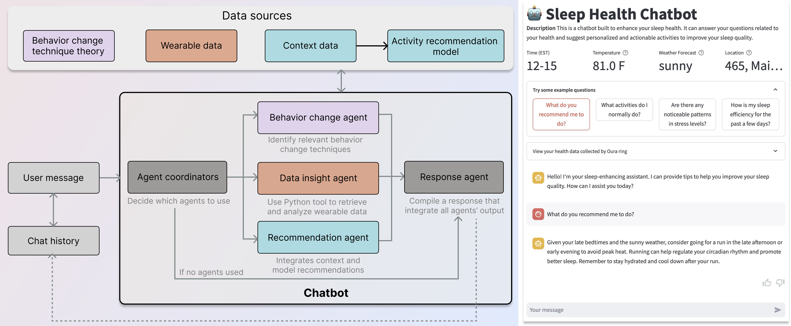

# Sleep Health Chatbot


## Exploring Personalized Health Support through Data-Driven, Theory-Guided LLMs: A Case Study in Sleep Health (CHI' 25)


[**Paper Preprint**](https://arxiv.org/abs/2502.13920)

This code base is a demonstration of a LLM-powered sleep health chatbot augmented by a multiagent framework to provide personalized, data-driven, and theory-guided sleep health support. The chatbot integrates wearable device data, contextual information, and established behavior change theories to deliver adaptive recommendations and motivational support.

## Project Structure

- `ThSleepHealthBot.py`: The main file for the chatbot interface and user interaction.
- `agent_coordinator.py`: Coordinates multiple specialized agents (e.g., Recommendation, Health Data Analysis) to handle different types of user queries effectively.
- `activityRec.py`: Contextual multi-armed bandit model for activity recommendation.
    - `generate_activity`: Generate synthetic data for activity recommendations research demonstration.
- `utils.py`: Utility functions for data retrieval and processing.
- `globalVariable.py`: Global variables for the project.
- `requirements.txt`: The dependencies for the project.
- `README.md`: The readme file for the project.
- `.streamlit`: The streamlit secret configuration file: `.streamlit/secrets.toml`.

## How to run
Python 3.10.13

### Install the dependencies
- Create a virtual environment: `python -m venv venv`
- Activate the virtual environment: `source venv/bin/activate`
- Install the dependencies: `pip install -r requirements.txt`

### Prepare the environment variables
(we have provided an example of recommendation model in the parent directory: `user_model.pkl`)
- Create a `.streamlit/secrets.toml` file in the `.streamlit` directory.
    ```toml
    [oura]
    oura_token = "input_your_oura_token"

    [weatherapi]
    weatherapi_key = "input_your_weatherapi_key"

    [user]
    pid = 1
    user_name = "johndoe"
    user_model_path = "user_model.pkl"
    ```
- Add the following variables:
    - `OPENAI_API_KEY`: The API key for the OpenAI API.
    - `oura_token`: The token for the Oura API.
    - `weatherapi_key`: The API key for the Weather AP for [WeatherAPI](https://www.weatherapi.com/).
    - User information: particpant id: `pid`, user name: `user_name`, user model path: `user_model_path`.
    - User information: 
      - `pid`: Participant ID
      - `user_name`: User name
      - `user_model_path`: Path to the user model file

### Run the chatbot
- Run the chatbot: `streamlit run ThSleepHealthBot.py`

### Train the recommendation model
Please refer to the `generate_activity.py` file for the code to train the recommendation model.


